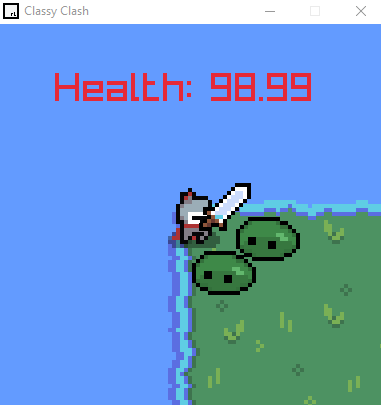

# GameDevClassyClash
Udemy course for a raylib Classy Clash. 
In Classy Clash we introduce Object Oriented Programming. You'll learn how this simplifies programming for games and how inheritance can avoid code duplication.

Relevant Links:
- [Udemy Course](https://www.udemy.com/course/cpp-fundamentals/?couponCode=OF83024E)
- [Tile Maps](https://www.mapeditor.org/)
- [Game Assets](https://itch.io/game-assets/free)

# Final Image (Own Implementation)

## Udemy Course
Udemy reference course.

## Tile Maps
Tiled is a 2D level editor that helps you develop the content of your game. Its primary feature is to edit tile maps of various forms, but it also supports free image placement as well as powerful ways to annotate your level with extra information used by the game. Tiled focuses on general flexibility while trying to stay intuitive.

## Game Assets
itch.io is an open marketplace for independent digital creators with a focus on independent video games. It’s a platform that enables anyone to sell the content they've created. As a seller you’re in charge of how it’s done: you set the price, you run sales, and you design your pages. It’s never necessary to get votes, likes, or follows to get your content approved, and you can make changes to how you distribute your work as frequently as you like.

## Function Override
- [Exemple](https://github.com/FroschFT/GameDevClassyClash/commit/179ec80d9ded44b9ca75070c955d41b44fad4bb0#r142183407)

## Arrow Operator
- [Exemple](https://github.com/FroschFT/GameDevClassyClash/commit/288074a3854e7582eea7a3968504563cd3884a42#r142183829)
